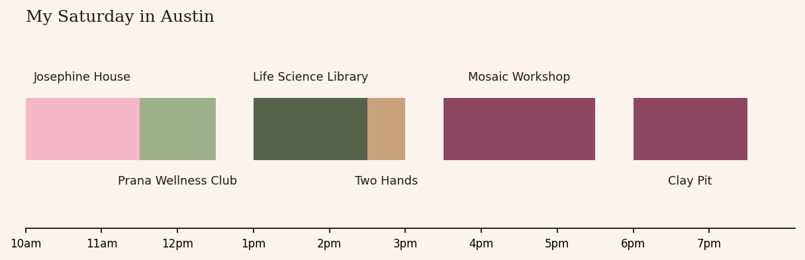

# Saturday in Austin ✦

**Tell it when you wake up, when you go to bed and how long you want to be out. It plans the best day around Austin.**

**[Try it live →](https://suhxnitiwari.github.io/saturday-in-austin/)** (the Python runs right in your browser)

Every run is a different Saturday, drawn from 100+ Austin spots: coffee shops, brunches, pottery studios, nail spas at the Domain, hikes on the Greenbelt, kayaking on Lady Bird Lake, game days at Victory Lap and nights in with pizza and a movie. Can't decide? Hit **🎲 Just pick for me**.

```
$ python -m saturday

Your Saturday ✦  everything, up at 9:00 AM, bed by 11:00 PM
  10:00 AM  Josephine House
  11:30 AM  Prana Wellness Club  (Pilates: the best reset)
   1:00 PM  Life Science Library  (the prettiest study spot)
   2:30 PM  Two Hands
   3:30 PM  Mosaic Workshop
   6:00 PM  Clay Pit  (North Indian)
   8:00 PM  home, happy

  6 stops · 9.7 hours out · 30 min of driving · seed 5
  run it again for a different Saturday ✦
```



## Try it

```bash
python3 -m venv .venv && .venv/bin/pip install matplotlib pytest
.venv/bin/python -m saturday                  # a surprise Saturday
.venv/bin/python -m saturday --mood treat-yourself
.venv/bin/python -m saturday --hours 6 --mood social --include "Victory Lap" --chart
.venv/bin/python -m pytest -q
```

| Option | What it does |
|---|---|
| `--wake 9:00` | when you wake up |
| `--sleep 23:00` | when you go to bed (after midnight works too) |
| `--hours 10` | how many hours you want to be out |
| `--mood` | `treat-yourself`, `adventurous`, `productive`, `social`, `day-in`, `cozy` or `everything` |
| `--home "West Campus"` | where the day starts and ends |
| `--include "Numero 28"` | a spot you have to go to (typos get a "did you mean?") |
| `--skip PCL` | a spot to leave out |
| `--chart` | save the day as a picture |
| `--seed 5` | repeat a Saturday you liked (every run prints its seed) |

## Six moods, six different Saturdays

| Mood | The day |
|---|---|
| ✨ Treat yourself | A Domain day: brunch at Toastique, nails at M Vince, a shopping run, dinner at Éma |
| 🥾 Adventurous | Hikes, kayaking and cold swims, at most two per day and never back to back |
| 📚 Productive | Café hopping: up to three coffee shops, with study spots in between |
| 🏈 Social | Built around Victory Lap or Topgolf, with group brunch and dinner |
| 🛋️ Day in | A late brunch, then a face mask, pizza delivered and a movie |
| 🕯️ Cozy & creative | Slow lattes, pottery and candle studios, bookstores and a warm dinner |

## The rules every plan follows

- Every stop starts when it makes sense: brunch in the morning, dinner in the evening, pottery before the studio closes.
- Stops start on the hour or half hour, like a real plan.
- You leave after getting ready and you're home before bed, and the planner picks the best stretch of the day for the hours you want out.
- One stop per slot: one midday meal (brunch *or* lunch), one dinner. Some moods allow more (three coffees on a productive day).
- Never the same kind of stop twice in a row, so there's always a break between two hikes.
- Out through lunchtime or dinnertime means a real meal, not just ice cream.
- Nothing after dinner except a late-night snack.
- There is always coffee (a treat-yourself day has nails instead, and a day in has pizza).

## How it works

The hard part is that the obvious approach doesn't work. Taking the highest-rated spots first ignores driving and opening hours: a long 10/10 dinner can push out two great afternoon stops. Trying every possible order works but explodes: 15 spots have over a trillion orderings.

1. **Map** (`city.py`): Austin's neighborhoods are a weighted graph, with roads measured in drive minutes. **Dijkstra's algorithm** with a min-heap finds the fastest drive between any two neighborhoods, and results are cached.
2. **Surprise** (`planner.shortlist`): filter by mood, then run a weighted lottery that picks two candidates per slot. Every favorite can win, and higher-rated ones win more often. It's weighted sampling without replacement (the Efraimidis-Spirakis method: each spot gets the key `random() ** (1 / weight)` and the biggest keys win). Must-haves always stay.
3. **Plan** (`planner.plan_day`): **dynamic programming over subsets** (bitmask DP). For every set of spots and every possible last stop, it keeps the earliest time you could finish. Finishing earlier is never worse, since you can always wait, so one number per state is enough. That turns *n!* orderings into 2ⁿ × n² steps, and a full day plans in a fraction of a second.
4. **Check** (`tests/`): a **backtracking** search that really does try every order runs on 40 random small days, and the DP has to match it every time. Other tests check that 60 random Saturdays all follow the rules, that every dinner spot gets its turn, and that the same seed always gives the same day.

The spots and their notes are my real favorites. Drive times, visit lengths and ratings are my own estimates. ✦
