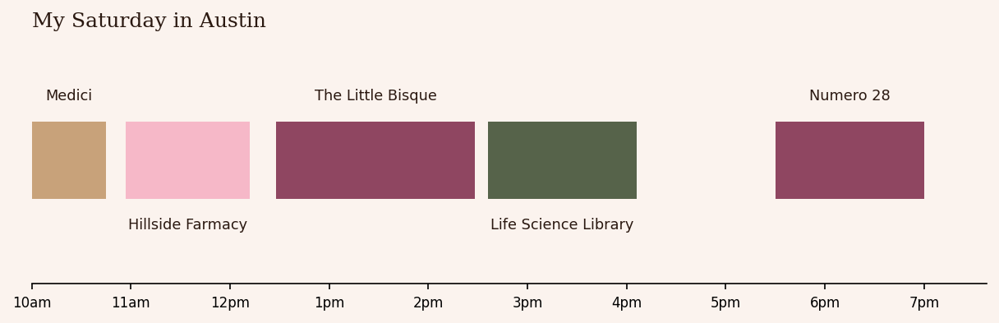

# Saturday in Austin ✦

**Tell it how long you have and what you're in the mood for. It plans the best day around Austin.**

```
$ python -m saturday --mood cozy

Your Saturday ✦  cozy, 10 hours from West Campus
  10:00 AM  Medici  (vanilla latte)
  10:57 AM  Hillside Farmacy
  12:28 PM  The Little Bisque  (pottery painting)
   2:36 PM  Life Science Library  (the prettiest study spot)
   4:06 PM  free time (1h 17m): nap, journal, wander
   5:30 PM  Numero 28  (good memories)
   7:08 PM  home, happy

  5 stops · 43 min of driving
```



## Try it

```bash
python3 -m venv .venv && .venv/bin/pip install matplotlib pytest
.venv/bin/python -m saturday --mood cozy
.venv/bin/python -m saturday --hours 6 --mood foodie --include "Clay Pit" --chart
.venv/bin/python -m pytest -q
```

| Option | What it does |
|---|---|
| `--hours 10` | how long you have |
| `--mood` | `cozy`, `creative`, `foodie`, `productive` or `everything` |
| `--start 10:00` | when you leave |
| `--home "West Campus"` | where the day starts and ends |
| `--include "Numero 28"` | a spot you have to go to (typos get a "did you mean?") |
| `--skip PCL` | a spot to leave out |
| `--chart` | save the day as a picture |

## The rules every plan follows

- Every stop starts when it makes sense: brunch in the morning, dinner in the evening, pottery before the studio closes.
- One stop per slot: one coffee, one midday meal (brunch *or* lunch), one dinner.
- Nothing after dinner except a late-night snack.
- There is always coffee.
- You're home by the time you said.

## How it works

The hard part is that the obvious approach doesn't work. Taking the highest-rated spots first ignores driving and opening hours: a long 10/10 dinner can push out two great afternoon stops. Trying every possible order works but explodes: 15 spots have over a trillion orderings.

1. **Map** (`city.py`): Austin's neighborhoods are a weighted graph, with roads measured in drive minutes. **Dijkstra's algorithm** with a min-heap finds the fastest drive between any two neighborhoods, and results are cached.
2. **Shortlist** (`planner.shortlist`): filter by mood, then keep the best two spots per slot. Must-haves always stay.
3. **Plan** (`planner.plan_day`): **dynamic programming over subsets** (bitmask DP). For every set of spots and every possible last stop, it keeps the earliest time you could finish. Finishing earlier is never worse, since you can always wait, so one number per state is enough. That turns *n!* orderings into 2ⁿ × n² steps, and a full day plans in a fraction of a second.
4. **Check** (`tests/`): a **backtracking** search that really does try every order runs on 40 random small days. The DP has to match it every time.

The spots and their notes are my real favorites. Drive times, visit lengths and ratings are my own estimates. ✦
