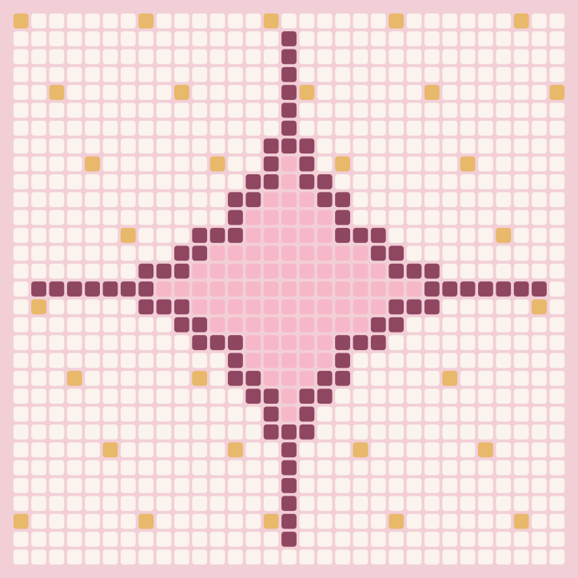
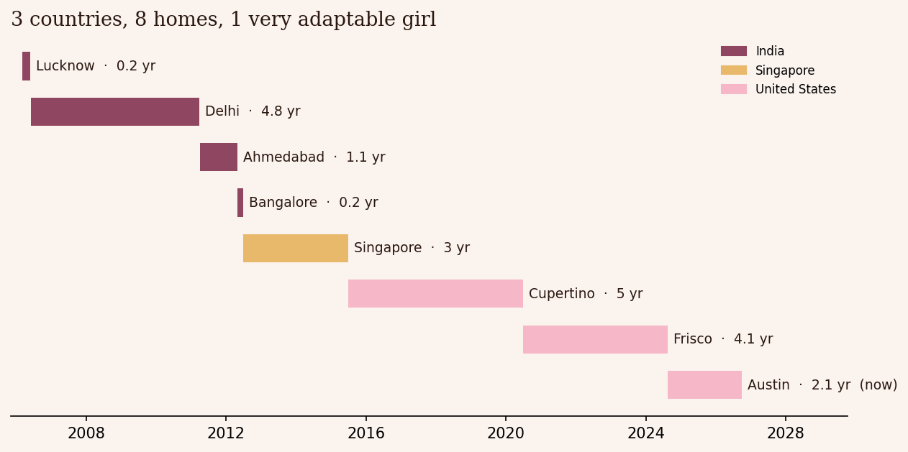

# Suhani OS ✦

**My life, as data structures and algorithms.** *Suhani Coded™*

One Python project that covers everything from CS 303E, CS 313E and MIS 304 (Programming for Data Analytics), but instead of homework prompts, every algorithm runs on something from my actual life: my bookshelf, my Läderach order, my fabric rule, my Austin Saturdays, the eight places I've lived.



## Run it

```bash
python3 -m venv .venv && .venv/bin/pip install pandas matplotlib pytest
.venv/bin/python -m suhani_os demo     # every module, one after another
.venv/bin/python -m suhani_os          # the interactive menu
.venv/bin/python -m pytest -q          # 33 tests
```

## What's inside

| Module | The Suhani part | The computer science part |
|---|---|---|
| `closet.py` | Cotton, linen, wool, silk. Polyester is not invited, even from LoveShackFancy. Food and flowers are extras, never the main gift. | Class hierarchy with inheritance and polymorphism, custom exceptions, set difference |
| `bookshelf.py` | All 30 books from my shelves: rom-coms, the ones that changed how I live, and the ones behind the business | Self-balancing **AVL tree** with all four rotations, delete, range query; merge sort, quicksort, binary search |
| `laderach.py` | The FrischSchoggi counter. Florentine, Salted Caramel, Hazelnut. | **Hash map** (separate chaining + resizing) and **max-heap** from scratch; greedy vs. **0/1 knapsack DP** |
| `bakery.py` | Cake orders for Amaira and Mumma, my banana bread, and toast that always burns | **Linked list**, **stack** (undo), **queue** from scratch; exact recipe scaling with `Fraction` |
| `austin.py` | A Perfect Saturday: Medici, the Life Science Library, Mosaic Workshop, dinner at Numero 28 | **Weighted graph**, Dijkstra, BFS; **bitmask DP** with time windows, checked against a **backtracking** brute force |
| `mosaic.py` | Mosaic Workshop in my website palette | **2D lists**, nested loops, recursive **flood fill**, graphics |
| `timeline.py` | 3 countries, 8 homes, 1 very adaptable girl | **pandas** (dates, computed columns, filtering, groupby) and **matplotlib** |
| `sitara.py` | A mini, offline version of Sitara, the fairy guide on my website | Strings, dictionaries, sets, JSON file I/O |



## Every topic, and where it lives

**CS 303E: Elements of Computers and Programming**

| Topic | Where |
|---|---|
| Variables, math, data types | `bakery.pretty_amount`, `timeline.load` |
| Modules, formatting | package layout; f-strings with widths and `:,.2f` everywhere |
| Booleans, conditionals | `closet.Gift.approve`, `austin.begin_at` |
| For and while loops, nested loops | `mosaic.draw_outline`, `bookshelf.binary_search` |
| Graphics | `mosaic.render` |
| Functions, decomposition | each module is small functions with one job |
| Lists, 2D lists | `mosaic.blank` (and why `[[x] * n] * m` is a bug) |
| Tuples and sets | `closet.NATURAL_FIBERS`, `sitara.tokenize` |
| Dictionaries, nested structures | `austin.Austin.graph` (dict of dicts), `bookshelf.shelves` |
| Files and strings | `bookshelf.load_books` (CSV), `sitara.Sitara` (JSON) |
| Modules and exceptions | `errors.py`, `closet.shop` (try / except / else) |
| Object-oriented programming | every module |
| Searching, sorting | `bookshelf.binary_search`, `merge_sort`, `quicksort` |
| Recursion | `mosaic.flood_fill`, `bookshelf._in_order`, `merge_sort` |

**CS 313E: Elements of Software Design**

| Topic | Where |
|---|---|
| Testing, debugging, exceptions, assertions | `tests/`, 33 tests including brute-force checks of both DPs |
| OOP and inheritance | `closet.py` class tree; `__str__`, `__repr__`, `__iter__`, `__contains__`, `__len__` |
| Algorithm complexity | Big-O in every docstring; AVL height vs. plain BST in the demo |
| Algorithm classes | greedy (`greedy_box`), divide and conquer (`merge_sort`), backtracking (`brute_force_saturday`), DP |
| Hashing | `laderach.FlavorMap` |
| Stacks, queues, linked lists | `bakery.Stack`, `bakery.Queue`, `bakery.StepList` |
| Binary trees, balanced trees | `bookshelf.Bookshelf` (AVL) |
| Heaps | `laderach.MaxHeap`, `heapq` in Dijkstra |
| Graphs, weighted graphs | `austin.fewest_stops` (BFS), `austin.drive` (Dijkstra) |
| Dynamic programming | `laderach.best_box` (knapsack), `austin.perfect_saturday` (bitmask DP) |

**MIS 304 / BAX 305: Programming for Data Analytics**

| Topic | Where |
|---|---|
| Data types, objects and data structures | throughout |
| if / for / while, `range()` | throughout |
| Tuples, dictionaries, sets, string formatting | `closet`, `sitara`, `bakery.Recipe.card` |
| Functions, reading and writing files | `load_books`, `load_spots`, `mosaic.render` |
| List comprehensions, operators | `mosaic.blank`, `quicksort`, `timeline.summary` |
| Intro to OOP | `closet.py` |
| pandas, filtering, advanced pandas | `timeline.load`, `timeline.summary` |
| Plotting, matplotlib | `timeline.chart`, `mosaic.render` |

---

Numbers like drive times, piece weights and joy scores are my own estimates for the demo. The books, the places I've lived and the rules are all real. ✦
